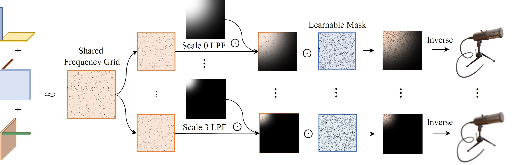

# FREQ-MIP-AA : FREQUENCY MIP REPRESENTATION FOR ANTI-ALIASING NEURAL RADIANCE FIELDS

[Youngin Park](https://github.com/yi0109),
[Seungtae Nam](https://github.com/stnamjef),
[Cheul-hee Hahm](),
[Eunbyung Park](https://silverbottlep.github.io/)*\
*Corresponding author\
International Conference on Image Processing (ICIP), 2024

# Architecture overview

* The overall architecture of our model begins with training a shared grid in the **frequency domain**. This is followed by
**scale-specific low-pass filters** designed to facilitate focus on crucial information. Subsequently, **learnable frequency masks** are
applied to further refine frequency grids. To enhance visual clarity, the grid is shown as a basic square shape, even though it is
fundamentally a vector matrix structure. The ⊙ represents element-wise multiplication.

# Environment setup

* conda create -n freqMipAA python=3.8
* conda activate freqMipAA
* pip install -r requirements.txt


# Training
* run the commands below at "/your/path/to/mipTensoRF" inside the docker container.

* FreqMipAA on the multi-scale blender dataset.
```
bash ./scripts/multiscale_freqMipAA.sh
```

# References
* [Mip-Grid](https://github.com/stnamjef/MipGrid)
* [Tri-MipRF](https://github.com/wbhu/Tri-MipRF)
* [TensoRF](https://github.com/apchenstu/TensoRF)